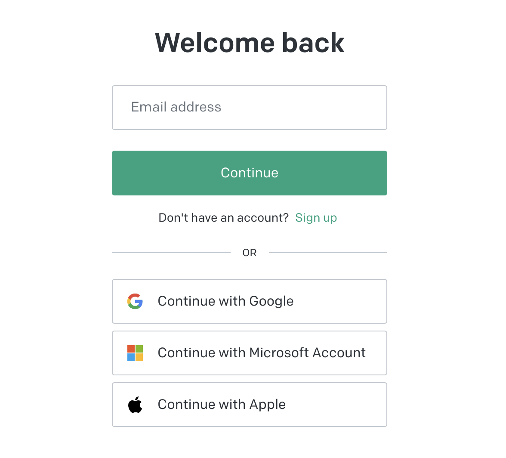
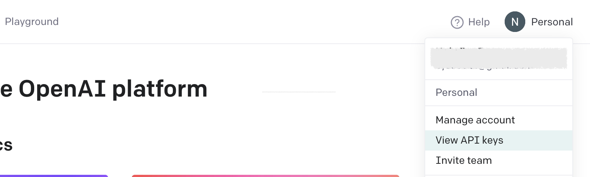
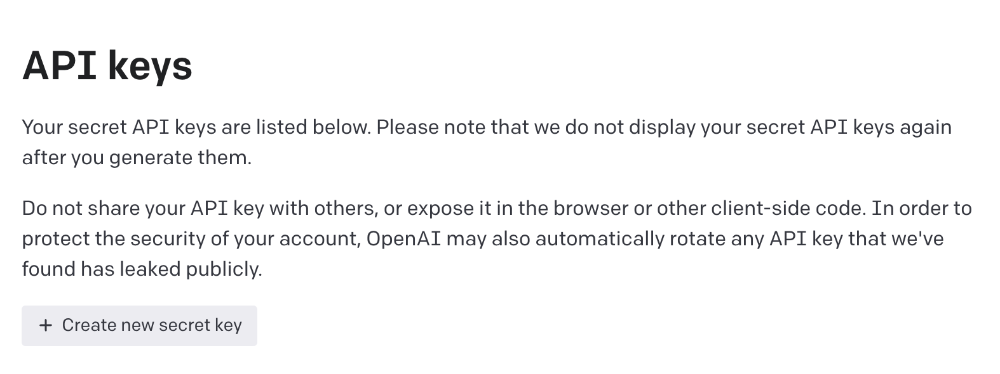
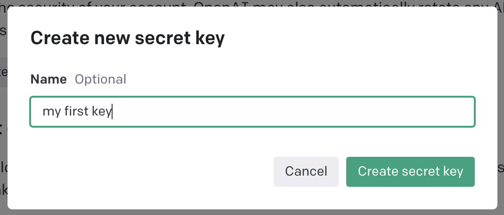
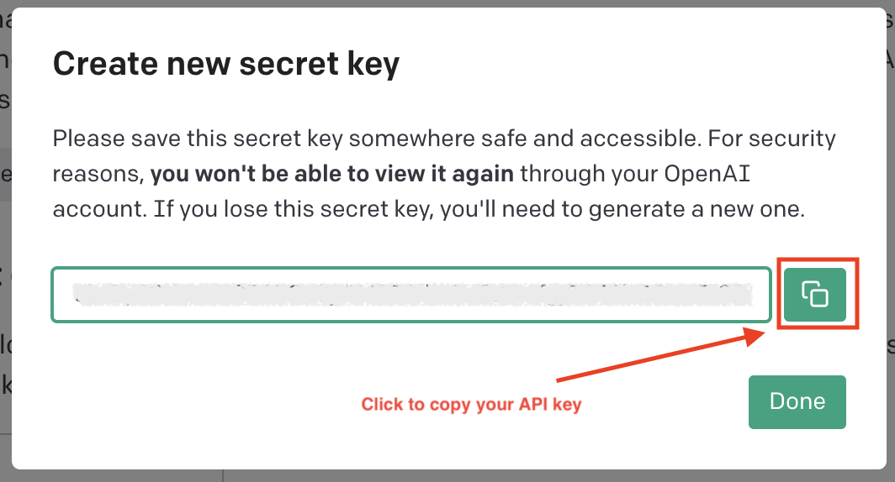

## OpenAI

The company which made the famous ChatGPT, GPT4, DALL-E.

### Creating an Account

First, visit the [OpenAI Platform Page](https://platform.openai.com/). If you already have an account, you can sign in directly, otherwise you can click "Sign Up" or sign in with your existing Google/Microsoft/Apple accounts.

### Get Your API Key

Once you have created an account and logged in, click on the top right corner, then click "View API Keys".

.

This will take you to the "API Keys" page. On this page, click "+ Create new secret key".

In the pop-up modal, you can enter the name of the key, such as "my test key", "my first key", or just leave it blank, and then click "Create Secret Key".

 

After that, you will then see a modal showing your API key. Click the "copy" button to the right to copy your API key. Please note that you may want to save the key somewhere, as it won't show up in OpenAI again. If you lose it, you will need to create a new one.

