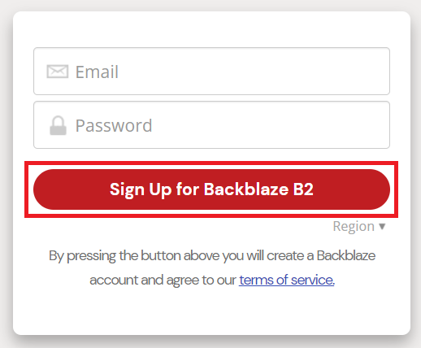
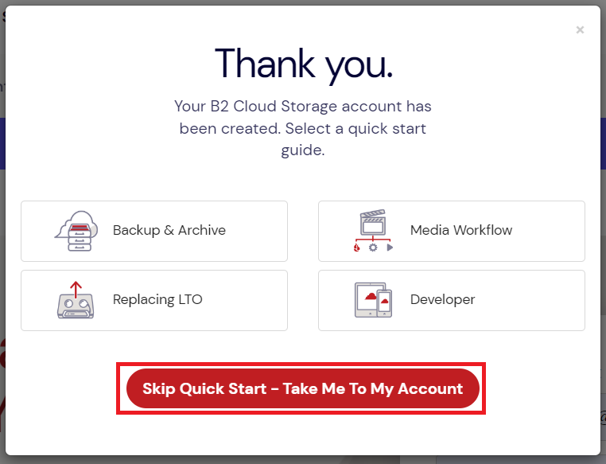
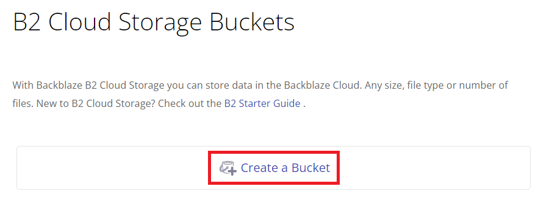
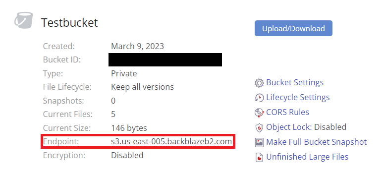
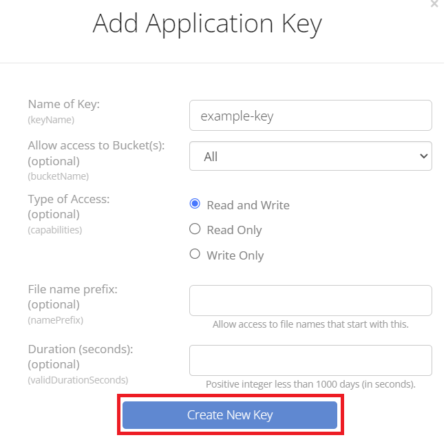
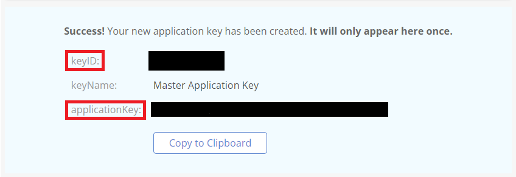

## Backblaze

Backblaze is a cloud storage service. While Backblaze offers its own client and interface to its storage buckets, it is **S3 compatible** which means you can use it with existing S3 libraries like **boto3**.

This is a step-by-step guide on setting up your own free Backblaze account and setting it up to work with OYOclass' [Python3 Editor](https://docs.oyoclass.com/python3editor/).

### Creating an Account

First, visit [Backblaze's Account Creation Page](https://www.backblaze.com/b2/cloud-storage.html) and enter the email you want to use and a password:

After you successfully create an account, a window will pop up asking you if you want to read several guides. You can just click the **Skip Quick Start** button:

### Creating a Bucket

To store data in an S3 service, we first need to make a **bucket**. Buckets are where files are stored in an S3 datatore. To create one with Backblaze, click on the **Create a Bucket** button:

A new window will pop up where you will be required to name your bucket and choose some settings on it. Take note of the following restrictions:

-   Bucket names are globally unique, so you may not be able to name your bucket exactly what you want to
-   Having files in your bucket be private requires you to verify your email first

After you choose your settings, click the **Create a Bucket** button at the bottom of the window:

### Finding Your Bucket's Endpoint URL

To use an S3 access like boto3 requires you provide an **endpoint URL** to where the bucket exists. Once you create your bucket, you can see your bucket's **endpoint URL** in your bucket's info:

### Managing Application Keys

Now that you have a bucket, we need to get access keys to authorize ourselves to access our bucket remotely. We can generate them easily by selecting **App Keys** on the left side of the page:

Then, click on **Add a New Application Key**:

    

        Note
    

    

        Backblaze offers a global access key, but <b>their global key does not work with s3 clients like boto3</b>. To support s3 clients, we must create a separate access key with this method.
    

A window will pop up asking you for various options. Just set the name of your key and click on **Create New Key**:

Finally, a box will show that has your **keyID** and **applicationKey**. This window will only ever show once, so if you lose your applicationKey, you will need to generate a new one. **Be sure not to share these keys with anyone**:

Congratulations! You have successfully set up your Backblaze bucket to work properly via remote connection. For a guide on how to get started using your bucket, check out the [Python3 Editor Docs](https://docs.oyoclass.com/python3editor/).
