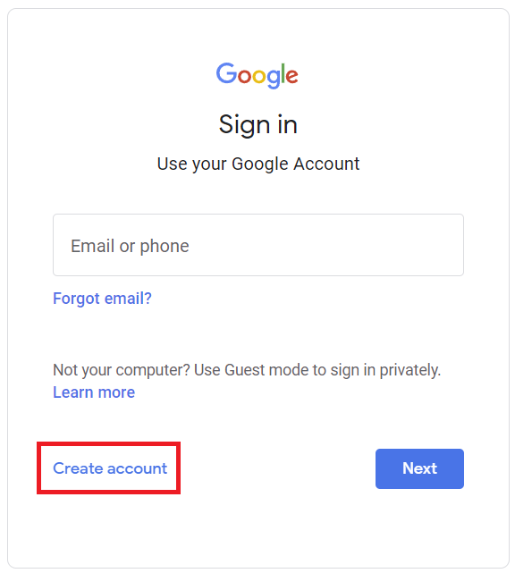
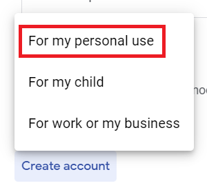
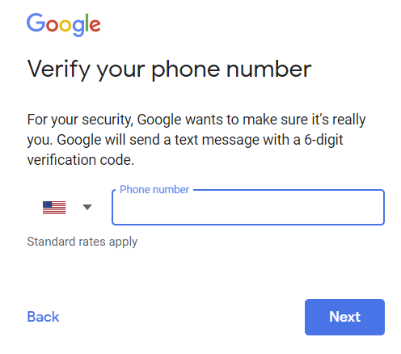
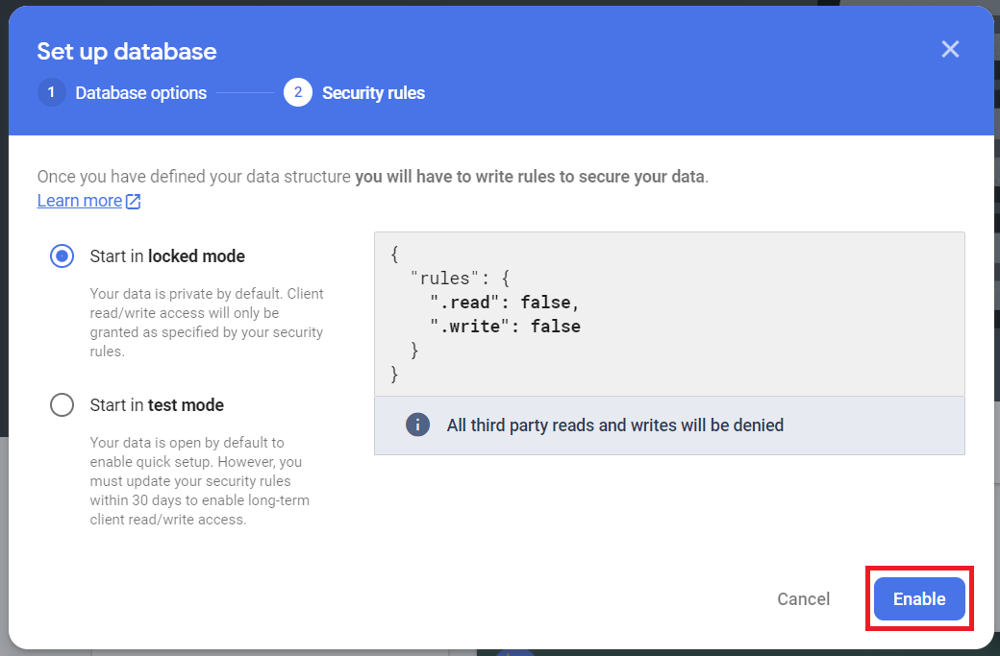

## Firebase

Firebase is a cloud development platform offered by Google. Firebase is a large and expansive service that can do many things, but one of the modules offered is a realtime database that can be accessed remotely.

This is a step-by-step guide on setting up your own free Firebase realtime database instance.

### Creating an Account

    

        Note
    

    

        If you already have a Google account, then you can skip to the <b>Creating a Project</b> section.
    

    

        You will need a working phone number to recieve a confirmation text to create a Google account.
    

To use Firebase, you must have a Google account. So the first thing we need to do is create one. Click on the **Get started** button and you will be brought to the Google sign in page:

Then, click on the **Create Account** button:

In the menu that appears, click **For My Personal Use**:

Fill out this info, then click **Next**:

Enter your phone number, then click **Next**:

After you verify your phone number, you will be asked for your birthdate. After you enter it and agree to Google's terms of service, you now have a fully functioning Google account, and can create a Firebase project!

### Creating a Project

Before we create a database, we need to create a **project** for it to be associated with. Click on **Create a project**:

Then in the next page, decide on a name and click **Continue**:

### Creating a Realtime Database

Now that we have a project, we need to add a realtime database to it. In your web browser, on the left side of your screen, find the **Build** section and click on **Realtime Database**:

On the next page, click on **Create Database**:

In the window that pops up, we won't need to change anything. Click on **Next**:

Then click on **Enable**:

Congratulations! Your database is now set up and ready to use! You will need to download the credentials JSON for your project to connect to it from your programs. You can read about how to get your Firebase realtime database working with Python3 Editor in the [Python3 Editor Docs](https://docs.oyoclass.com/python3editor/)
