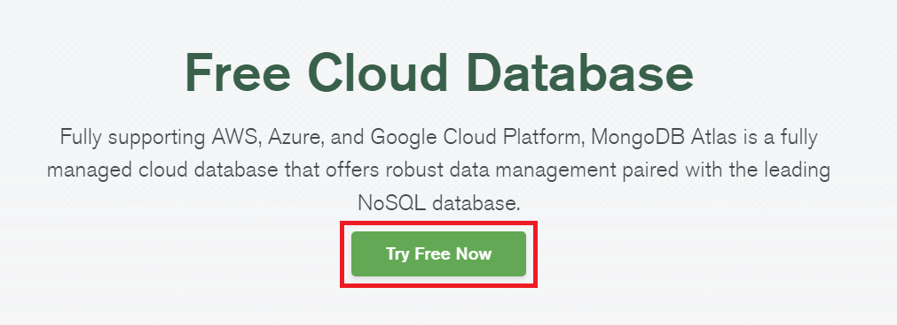
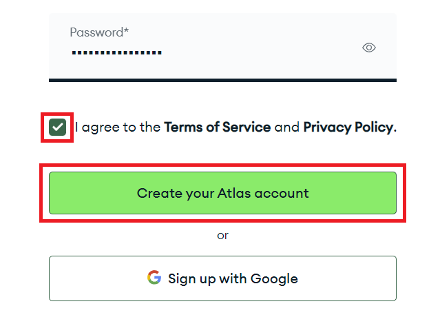
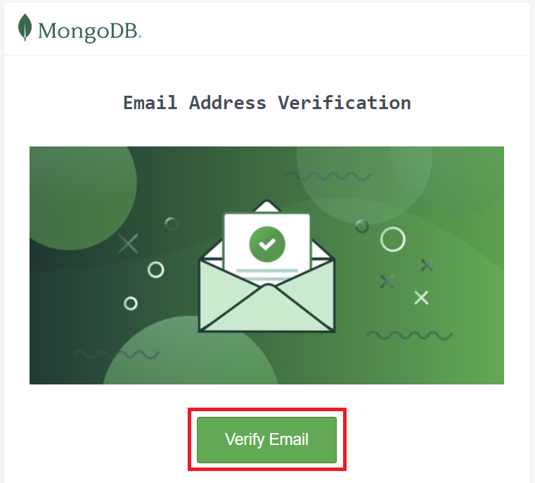
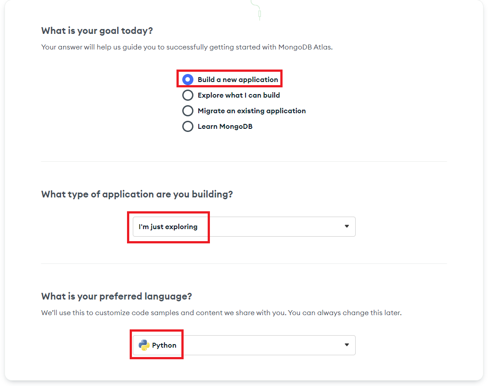
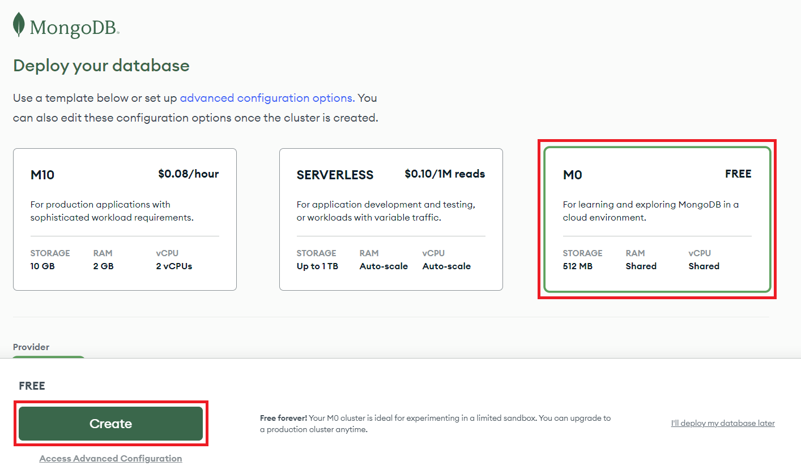
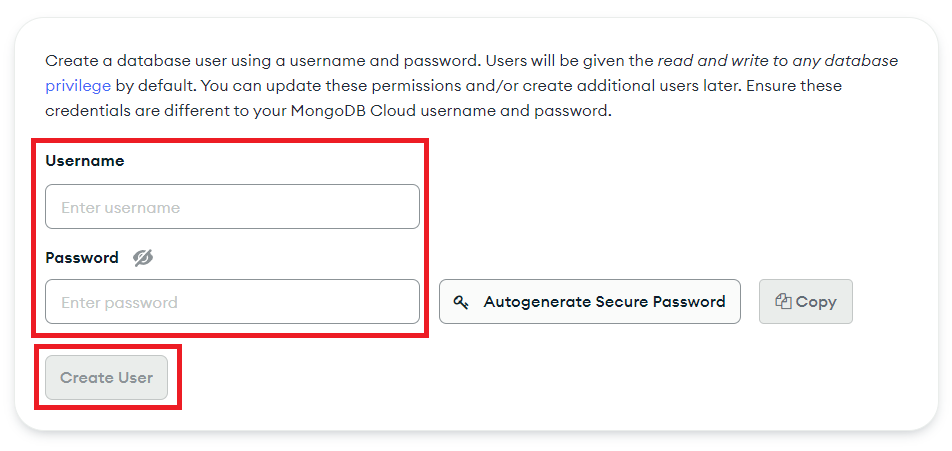
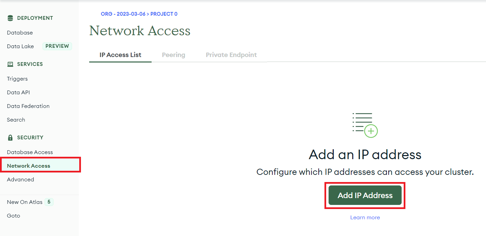
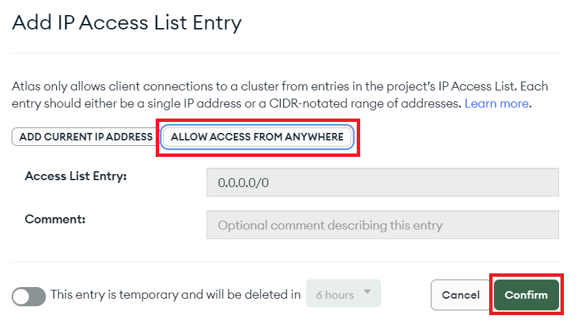

## MongoDB

MongoDB is a popular **NoSQL** database that can be run on the cloud. MongoDB offers a fully free basic cloud database that you can use how you wish, and works with OYOclass' [Python3 Editor](https://docs.oyoclass.com/python3editor/).

This is a step-by-step guide on setting up your own free cloud Mongo instance.

### Creating an Account

First, go to [Mongo's Free Cloud Database](https://www.mongodb.com/free-cloud-database) page, and click on the **Try Free Now** button:

You will then be taken to a small signup form. You can leave the _Company_ field blank, but you need to fill in your _First Name_, _Last Name_, _Email_, and _Password_. Agree to the **Terms of Service** and finish creating your account:

You will be required to confirm your email address. Open up your email account and click on the **Verify Email** button when you receieve the email:

### Creating Your Database

Once you create an account with the link above, we need to actually create a database. To do this, we can select the following options during account creation:

Then when asked which database type we want, we will choose **M0** because it is free:

Now, the last step of the basic setup is to **create a user in the database**. This is different from your Mongo account, this is an account you define inside your own database. Choose any username and password you want, **but don't forget it**. We will need the username and password later to connect to the database:

### Setting Up Your Database to Work With Python3 Editor

Now that we have a fully running Mongo cloud database, we need to make it so Python3 Editor is allowed to connect to it. To do this, we need to do one more thing:

Click on **Network Access** on the left side of your screen in MongoDB Cloud, then click on **Add IP Address**:

In the window that pops up, click on **ALLOW ACCESS FROM ANYWHERE** then click **Confirm**:

Congratulations! You have successfully set up your Mongo cloud instance to work properly via remote connection. For a guide on how to get started using your database, check out the [Python3 Editor PyMongo Docs](https://docs.oyoclass.com/python3editor/extralibs/pymongo).
