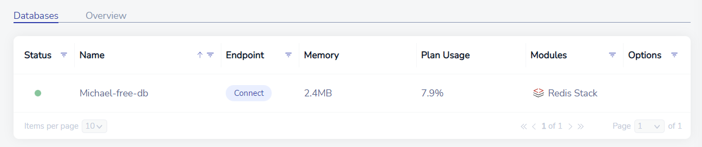

## Redis

Redis is an in-memory datastore which boasts high speed data storage and access. Redis is most often used for caching frequently used data that doesn't need to be stored forever, such as client sessions for a web service.

Redis offers a free version of their enterprise cloud for personal use. This is a step-by-step guide on setting up an account with Redis.

### Creating an Account

First, visit [Redis' Try Free Page](https://redis.com/try-free/) and either fill out the form or login with a Google/GitHub account:

Depending on your sign-up method, an email confirmation may be sent. Confirm your email address then proceed to the next step.

### Creating a Database

You will automatically be brought to the page to create your database. You can simply leave the settings in their defaults and just click the **Let's start free** button:

You should immediately see your database being set up. After a couple of minutes, your database will be fully ready to be used:

Congratulations! You have successfully set up your Redis cloud instance to work properly via remote connection. For a guide on how to get started using your database, check out the [Python3 Editor Redis Docs](https://docs.oyoclass.com/python3editor/extralibs/redis).
